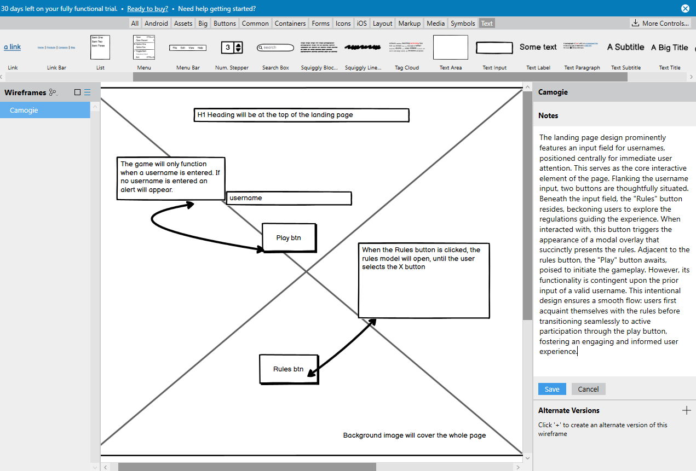
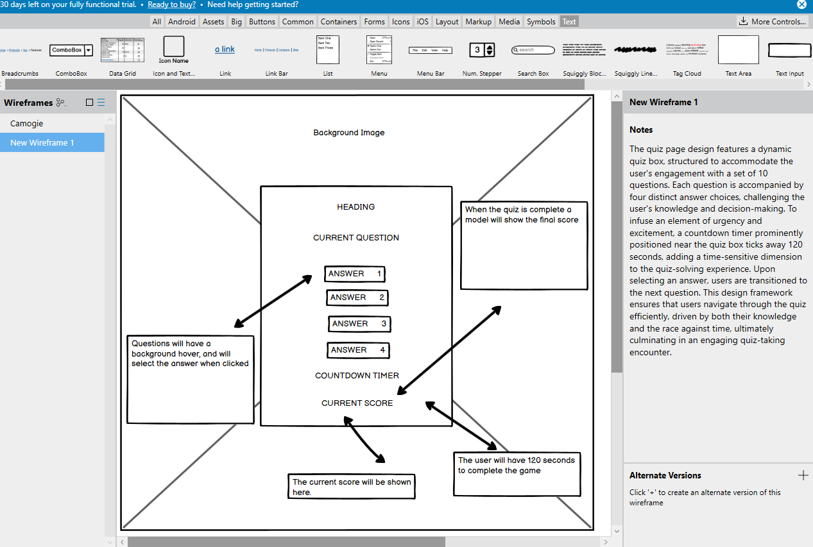
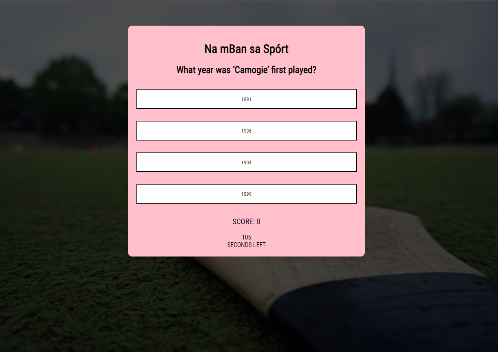
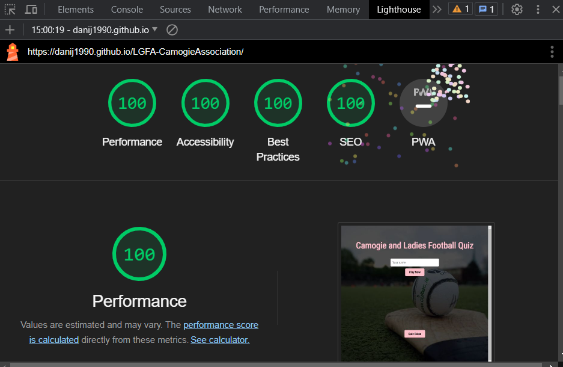
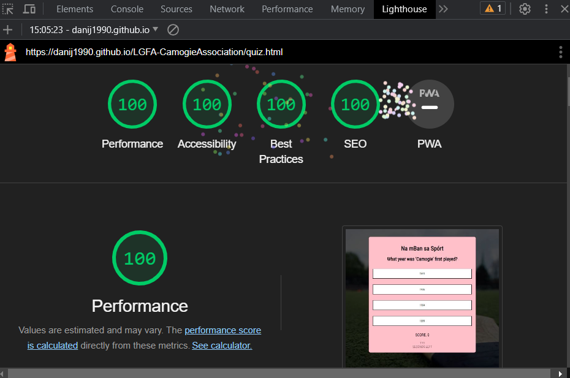

# Camogie and Ladies Football Quiz - Promoting Women's Sports in Ireland

Welcome to the Camogie and Ladies Football Quiz! 🏐🌟

## Project Overview

In the heart of Ireland's rich sporting culture, the Camogie and Ladies Football Quiz aims to shine a spotlight on the remarkable world of women's sports. Focusing on the exhilarating games of camogie and ladies football, this project is dedicated to increasing awareness, knowledge, and enthusiasm for these sports across the nation.

**Our Mission:** 

Our mission is simple yet powerful — to bring more visibility, understanding, and appreciation to camogie and ladies football in Ireland. We believe that these sports deserve recognition on par with their male counterparts, and through this quiz, we're taking a step toward making that a reality.

**Why It Matters:**

While the popularity of men's sports is widespread, the remarkable accomplishments and incredible talents within camogie and ladies football often go unnoticed. This quiz is a small effort to change that. By providing a fun and informative platform, we hope to inspire a greater following and foster a sense of unity and pride among fans, players, and enthusiasts.

**For All Ages and Abilities:**

We're committed to making this quiz accessible to everyone, regardless of age or computer literacy. Our user-friendly interface ensures that everyone, from young aspiring athletes to seasoned supporters, can engage with the quiz and deepen their knowledge of these captivating sports.

**A Glimpse into the Quiz:**

Through a series of thought-provoking questions, captivating facts, and inspiring stories, the Camogie and Ladies Football Quiz will take you on a journey through the history, achievements, and intricacies of these sports. Whether you're a dedicated follower or just starting to explore, this quiz promises to provide valuable insights and an enjoyable experience.

**Join Us:**

Together, let's make a difference in the world of women's sports. Join us in celebrating the achievements, dedication, and passion of camogie and ladies football players. By expanding our understanding and sharing our knowledge, we can work towards ensuring that the women's game stands tall alongside the men's game in Ireland.

Are you ready to test your knowledge and embark on this exciting journey? Let's dive into the Camogie and Ladies Football Quiz and play our part in shaping the future of women's sports in Ireland! 🏆🌍

### Wireframe

The landing page design prominently features an input field for usernames, positioned centrally for immediate user attention. This serves as the core interactive element of the page. Flanking the username input, two buttons are thoughtfully situated. Beneath the input field, the "Play" button resides, beckoning users to explore the regulations guiding the experience. When interacted with, this button triggers the appearance of a modal overlay that succinctly presents the rules. Adjacent to the rules button, the "Rules" button awaits, poised to initiate the gameplay. However, its functionality is contingent upon the prior input of a valid username. This intentional design ensures a smooth flow: users first acquaint themselves with the rules before transitioning seamlessly to active participation through the play button, fostering an engaging and informed user experience, the background image will cover the whole page.

The quiz page design features a dynamic quiz box, structured to accommodate the user's engagement with a set of 10 questions. Each question is accompanied by four distinct answer choices, challenging the user's knowledge and decision-making. To infuse an element of urgency and excitement, a countdown timer prominently positioned near the quiz box ticks away 120 seconds, adding a time-sensitive dimension to the quiz-solving experience. Upon selecting an answer, users are transitioned to the next question. This design framework ensures that users navigate through the quiz efficiently, driven by both their knowledge and the race against time, ultimately culminating in an engaging quiz-taking encounter.

## Getting Started

Welcome to our quiz app, where knowledge meets excitement! Our thoughtfully designed landing page sets the stage for an engaging and stimulating experience. As you enter, you'll be greeted by a user-friendly interface featuring a prominently placed username input field, ensuring a personalized journey from the very start. Alongside, two distinct buttons beckon your curiosity: one dedicated to acquainting you with the rules of the game, providing a clear roadmap to navigate the quiz successfully; the other, your gateway to embarking on the quiz adventure. 

Upon entering the quiz page, a series of ten thought-provoking questions, each accompanied by four carefully crafted answer choices. Your mental acuity and knowledge will be put to the test as you navigate through these intriguing inquiries. Once you've bravely tackled the final question, your score will be calculated, providing an insightful measure of your quiz prowess. However, the journey doesn't end there. After closing the final score tab, you will be redirected back to our landing page, to see if you can beat your high score.

### Testing

1. **Username Input Validation:**
    - Test entering a valid username.
    - Test entering an invalid username (e.g., special characters, long strings).
    - Test leaving the username field empty.

2. **Rules Button:**
    - Test clicking the "Rules" button.
    - Test if the rules information is displayed correctly.
    - Test if you can close the rules information.

3. **Start Button:**
    - Test clicking the "Start Quiz" button.
    - Test if the quiz questions load properly.
    - Test if the answer choices are displayed correctly.

4. **Answer Selection:**
    - Test selecting a correct answer and verifying if it's marked as correct.
    - Test selecting an incorrect answer and verifying if it's marked as incorrect.
    - Test selecting an answer, changing your mind, and selecting a different one.

5. **Quiz Progress:**
    - Test if the quiz progresses through all the questions.
    - Test if the app prevents going to the next question without answering the current one.

6. **Quiz Completion:**
    - Test answering all questions and completing the quiz.
    - Test answering no questions and trying to complete the quiz.
    - Test different combinations of correct and incorrect answers to ensure scoring accuracy.

7. **Score Calculation:**
    - Test if the score is calculated accurately based on the answered questions.
    - Test if the score is displayed correctly at the end of the quiz.

8. **Final Score Tab:**
    - Test closing the final score tab and ensuring redirection to the landing page.

9. **Responsive Design:**
    - Test the app's responsiveness on different screen sizes (using browser developer tools or real devices).
    - Test if the layout, input fields, buttons, and text adjust properly on smaller screens.

10. **Cross-Browser Compatibility:**
    - Test the app on different web browsers (Chrome, Firefox, Safari, Edge) to ensure consistent functionality and appearance.

11. **Performance:**
    - Test the app's loading speed, especially if there are image assets or complex animations.
    - Test for any memory leaks or performance issues during long quiz sessions.

12. **Device Testing:**
Test your app on various devices such as smartphones, tablets, laptops, and desktops to ensure it looks and functions well across different screen sizes.

**LightHouse**
I also tested both my home and quiz page using lighthouse. 

I have provided screenshots below

**Code**

 JavaScript code that passes through a linter (e.g. Jshint) with no significant issues.

Custom HTML code that passes through the official W3C validator with no issues.

Custom CSS code that passes through the official (Jigsaw) validator with no issues

## Features

### Technologies Used

- **HTML:** The foundation of the website's structure and content.
- **CSS:** Styling and layout to enhance the visual appeal and user experience.
- **JavaScript:** Interactive elements, dynamic content, and user engagement.
- **Codeanywhere:** Online development environment for coding and collaboration.
- **GitHub:** Version control and collaboration platform for hosting and managing the project.
- **Git:** Version control system to track changes and manage codebase.
- **Favicon:** Custom icons displayed in the browser's tab or bookmark bar.
- **Balsamiq:** Wireframing tool used for designing the initial website layout.
- **Unsplash:** Source of high-quality images to enhance visual aesthetics.

### Key Features

1. **Interactive Quiz:** Engaging quiz section featuring questions related to Camogie and LGFA.
2. **Score Tracking:** Real-time score tracking to keep users informed about their progress.
3. **Feedback Animation:** Visually appealing feedback animation for correct and incorrect answers.
4. **Modal Popups:** Informative modals for displaying final scores and quiz rules.
5. **Responsive Design:** Ensures a seamless experience across various screen sizes and devices.
6. **Custom Styling:** Thoughtful styling using CSS to create an attractive and consistent design.
7. **GitHub Hosting:** Hosted on GitHub Pages for easy access and sharing with others.

### Development Process

1. **Design Phase:** Wireframing with Balsamiq to plan the layout and visual elements.
2. **Coding:** Implemented the design using HTML, CSS, and JavaScript for interactivity.
3. **Version Control:** Utilized Git for tracking changes and collaboration with GitHub.
4. **Testing:** Thoroughly tested the website's responsiveness and functionality.
5. **Deployment:** Hosted the website on GitHub Pages for public access.

### Prerequisites

List any software, tools, or knowledge that users need before starting with your project.

### Installation

Step-by-step guide on how to install and set up your project locally.

## Usage

Demonstrate how to use your project or showcase its main functionality. You can include code examples, screenshots, or gifs.

## Features

Highlight the key features of your project. You can use a bullet point list or elaborate with brief descriptions.

## Contributing

Explain how others can contribute to your project. Provide guidelines for submitting issues or pull requests.

## License

Specify the license under which your project is distributed. For example:

This project is licensed under the [MIT License](LICENSE).
