# Camogie and Ladies Football Quiz - Promoting Women's Sports in Ireland

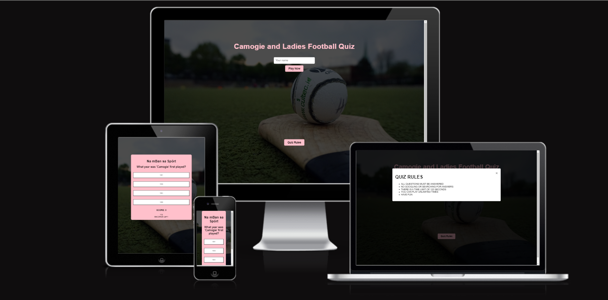

Welcome to the Camogie and Ladies Football Quiz! 🏐🌟

## Project Overview

In the heart of Ireland's rich sporting culture, the Camogie and Ladies Football Quiz aims to shine a spotlight on the remarkable world of women's sports. Focusing on the exhilarating games of camogie and ladies football, this project is dedicated to increasing awareness, knowledge, and enthusiasm for these sports across the nation.

**Our Mission:** 

Our mission is simple yet powerful — to bring more visibility, understanding, and appreciation to camogie and ladies football in Ireland. We believe that these sports deserve recognition on par with their male counterparts, and through this quiz, we're taking a step toward making that a reality.

**Why It Matters:**

While the popularity of men's sports is widespread, the remarkable accomplishments and incredible talents within camogie and ladies football often go unnoticed. This quiz is a small effort to change that. By providing a fun and informative platform, we hope to inspire a greater following and foster a sense of unity and pride among fans, players, and enthusiasts.

**For All Ages and Abilities:**

We're committed to making this quiz accessible to everyone, regardless of age or computer literacy. Our user-friendly interface ensures that everyone, from young aspiring athletes to seasoned supporters, can engage with the quiz and deepen their knowledge of these captivating sports.

**A Glimpse into the Quiz:**

Through a series of thought-provoking questions, captivating facts, and inspiring stories, the Camogie and Ladies Football Quiz will take you on a journey through the history, achievements, and intricacies of these sports. Whether you're a dedicated follower or just starting to explore, this quiz promises to provide valuable insights and an enjoyable experience.

**Join Us:**

Together, let's make a difference in the world of women's sports. Join us in celebrating the achievements, dedication, and passion of camogie and ladies football players. By expanding our understanding and sharing our knowledge, we can work towards ensuring that the women's game stands tall alongside the men's game in Ireland.

Are you ready to test your knowledge and embark on this exciting journey? Let's dive into the Camogie and Ladies Football Quiz and play our part in shaping the future of women's sports in Ireland! 🏆🌍

### Wireframe

The landing page design prominently features an input field for usernames, positioned centrally for immediate user attention. This serves as the core interactive element of the page. Flanking the username input, two buttons are thoughtfully situated. Beneath the input field, the "Play" button resides, beckoning users to explore the regulations guiding the experience. When interacted with, this button triggers the appearance of a modal overlay that succinctly presents the rules. Adjacent to the rules button, the "Rules" button awaits, poised to initiate the gameplay. However, its functionality is contingent upon the prior input of a valid username. This intentional design ensures a smooth flow: users first acquaint themselves with the rules before transitioning seamlessly to active participation through the play button, fostering an engaging and informed user experience, the background image will cover the whole page.


The quiz page design features a dynamic quiz box, structured to accommodate the user's engagement with a set of 10 questions. Each question is accompanied by four distinct answer choices, challenging the user's knowledge and decision-making. To infuse an element of urgency and excitement, a countdown timer prominently positioned near the quiz box ticks away 120 seconds, adding a time-sensitive dimension to the quiz-solving experience. Upon selecting an answer, users are transitioned to the next question. This design framework ensures that users navigate through the quiz efficiently, driven by both their knowledge and the race against time, ultimately culminating in an engaging quiz-taking encounter.


## Getting Started

Welcome to our quiz app, where knowledge meets excitement! Our thoughtfully designed landing page sets the stage for an engaging and stimulating experience. As you enter, you'll be greeted by a user-friendly interface featuring a prominently placed username input field, ensuring a personalized journey from the very start. Alongside, two distinct buttons beckon your curiosity: one dedicated to acquainting you with the rules of the game, providing a clear roadmap to navigate the quiz successfully; the other, your gateway to embarking on the quiz adventure. 


Upon entering the quiz page, a series of ten thought-provoking questions, each accompanied by four carefully crafted answer choices. Your mental acuity and knowledge will be put to the test as you navigate through these intriguing inquiries. Once you've bravely tackled the final question, your score will be calculated, providing an insightful measure of your quiz prowess. However, the journey doesn't end there. After closing the final score tab, you will be redirected back to our landing page, to see if you can beat your high score.


Welcome to the Quiz App! As you tackle the quiz questions, simply click on an answer to highlight your choice. If your answer is correct, you'll earn a point. 

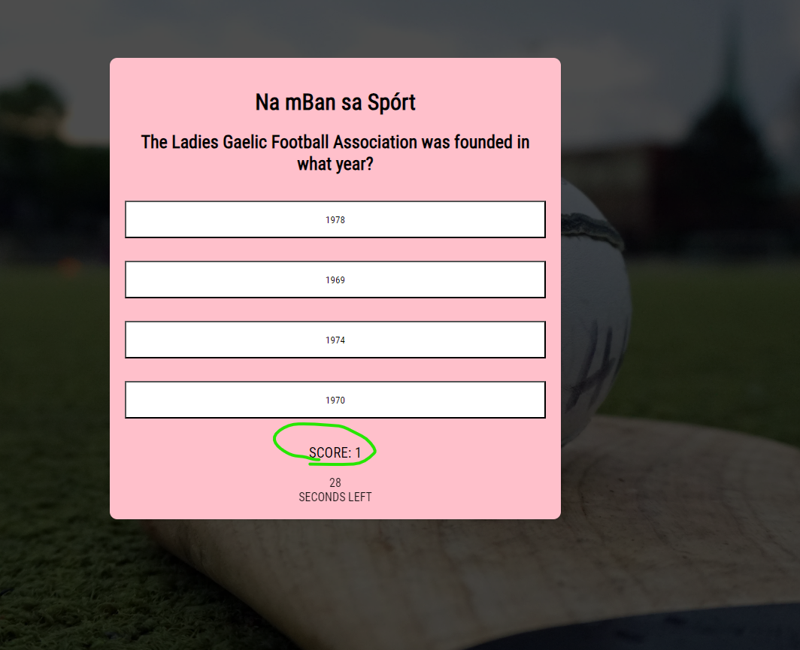

But don't worry if it's incorrect the app will provide guidance to help you learn. Enjoy the quiz and have fun improving your knowledge!

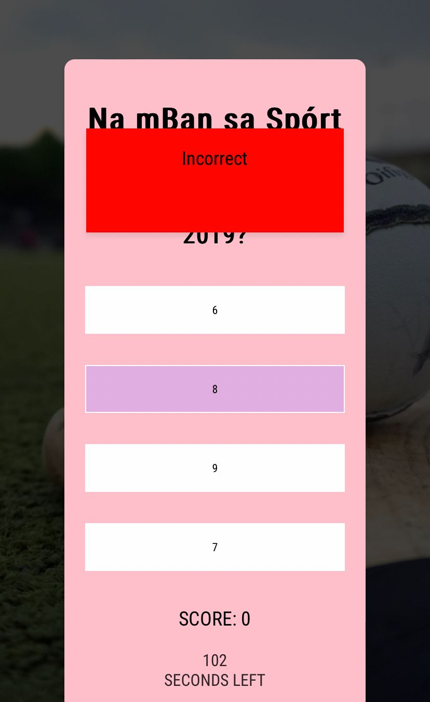

During the quiz, keep an eye on your score and the timer located at the bottom of the screen. Once you've completed the quiz, a modal will reveal your final score. After exiting the modal, you'll be redirected to the homepage, where you can aim to surpass your previous score in another attempt.

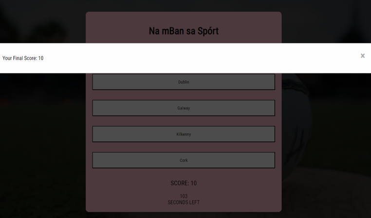

Our 404 page is designed to help users get back on track. If they land on a page that doesn't exist, we display a friendly 'Page Not Found' message along with a link to our main page. Clicking on this link automatically takes users back to our website's home page. This way, even if they end up on a wrong page, they can easily find their way back to our content.

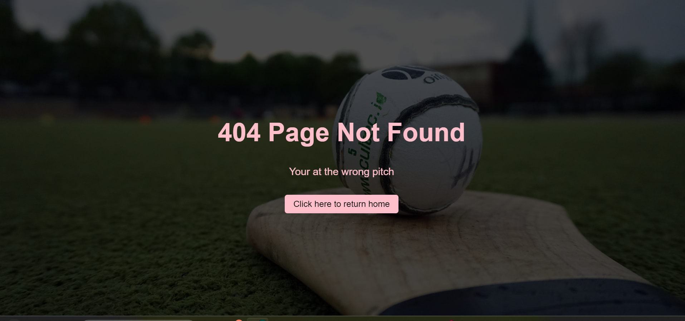

### Testing Carried Out 

1. **Username Input Validation:**
    - Test entering a valid username.
    - Test entering an invalid username (e.g., special characters, long strings).
    - Test leaving the username field empty.

2. **Rules Button:**
    - Test clicking the "Rules" button.
    - Test if the rules information is displayed correctly.
    - Test if you can close the rules information.

3. **Start Button:**
    - Test clicking the "Start Quiz" button.
    - Test if the quiz questions load properly.
    - Test if the answer choices are displayed correctly.

4. **Answer Selection:**
    - Test selecting a correct answer and verifying if it's marked as correct.
    - Test selecting an incorrect answer and verifying if it's marked as incorrect.
    - Test selecting an answer, changing your mind, and selecting a different one.

5. **Quiz Progress:**
    - Test if the quiz progresses through all the questions.
    - Test if the app prevents going to the next question without answering the current one.

6. **Quiz Completion:**
    - Test answering all questions and completing the quiz.
    - Test answering no questions and trying to complete the quiz.
    - Test different combinations of correct and incorrect answers to ensure scoring accuracy.

7. **Score Calculation:**
    - Test if the score is calculated accurately based on the answered questions.
    - Test if the score is displayed correctly at the end of the quiz.

8. **Final Score Tab:**
    - Test closing the final score tab and ensuring redirection to the landing page.

9. **Responsive Design:**
    - Test the app's responsiveness on different screen sizes (using browser developer tools or real devices).
    - Test if the layout, input fields, buttons, and text adjust properly on smaller screens.

10. **Cross-Browser Compatibility:**
    - Test the app on different web browsers (Chrome, Firefox, Safari, Edge) to ensure consistent functionality and appearance.

11. **Performance:**
    - Test the app's loading speed, especially if there are image assets or complex animations.
    - Test for any memory leaks or performance issues during long quiz sessions.

12. **Device Testing:**
Test your app on various devices such as smartphones, tablets, laptops, and desktops to ensure it looks and functions well across different screen sizes.


### Test Results 

**Username Input Validation:**

1. Successfully entered a valid username.
2. Confirmed that entering an invalid username (e.g., special characters, long strings) triggers appropriate validation.
3. Verified that leaving the username field empty prompts the expected validation message.

**Rules Button:**

1. Confirmed that clicking the "Rules" button opens the rules information modal.
2. Verified that the rules information is displayed correctly within the modal.
3. Successfully closed the rules information modal using the close button.

**Start Button:**

1. Confirmed that clicking the "Start Quiz" button initiates the quiz.
2. Verified that the quiz questions load properly and are displayed as expected.
3. Ensured that the answer choices are correctly presented for each question.

**Answer Selection:**

1. Successfully selected a correct answer and verified that it is marked as correct.
2. Confirmed that selecting an incorrect answer results in appropriate marking as incorrect.
3. Verified the ability to change an answer selection before moving to the next question.

**Quiz Progress:**

1. Confirmed that the quiz progresses through all questions in the correct sequence.
2. Verified that the app prevents proceeding to the next question without answering the current one.

**Quiz Completion:**

1. Successfully answered all questions and received a completion notification.
2. Confirmed that attempting to complete the quiz without answering any questions prompts a validation message.
3. Tested various combinations of correct and incorrect answers to ensure scoring accuracy.

**Score Calculation:**

1. Verified that the score is accurately calculated based on the number of correct answers.
2. Confirmed that the displayed score at the end of the quiz matches the calculated score.

**Final Score Tab:**

1. Successfully closed the final score tab and verified redirection to the landing page.

**Responsive Design:**

1. Tested the app's responsiveness using browser developer tools across different screen sizes.
2. Confirmed that the layout, input fields, buttons, and text adapt appropriately on smaller screens.

**Cross-Browser Compatibility:**

1. Tested the app on various web browsers (Chrome, Firefox, Safari, Edge) to ensure consistent functionality and appearance.

**Performance:**

1. Verified the app's loading speed, especially with image assets or animations.
2. Confirmed absence of memory leaks or performance issues during extended quiz sessions.

**Device Testing:**

1. Tested the app on smartphones, tablets, laptops, and desktops to ensure a seamless experience across different screen sizes.

By carrying out these tests and successfully confirming each scenario, you have ensured that your application works as expected and provides a smooth and reliable user experience.

**LightHouse**
I also tested both my home and quiz page using lighthouse the both passed through lighthouse with out issues. 

I have provided screenshots below


**WAVE Web Accessibility Evaluation Tools**
To dive deeper into testing contrast issues I also used WAVE, no contrast errors to report. 
<https://wave.webaim.org/>

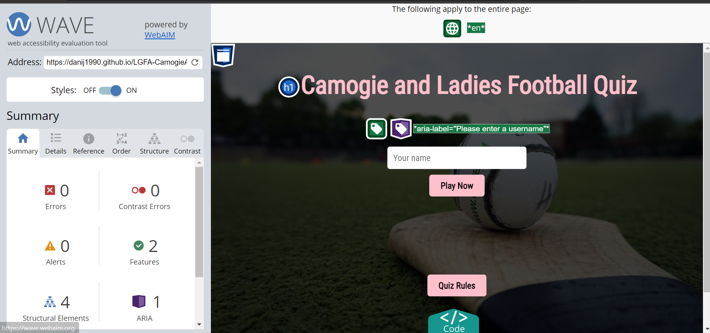

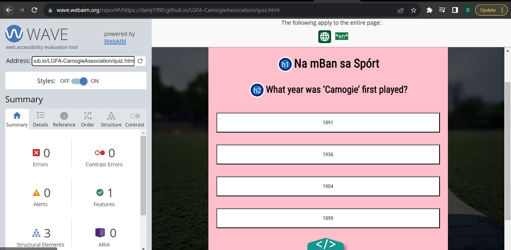

**Code**

I have passed my custom script.js file through JShint with no issues.

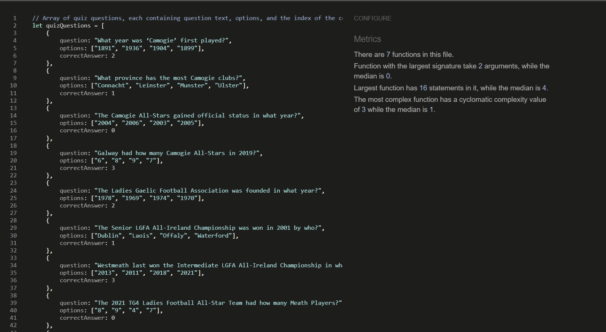

I have passed my custom Home.js file through JShint with no issues.

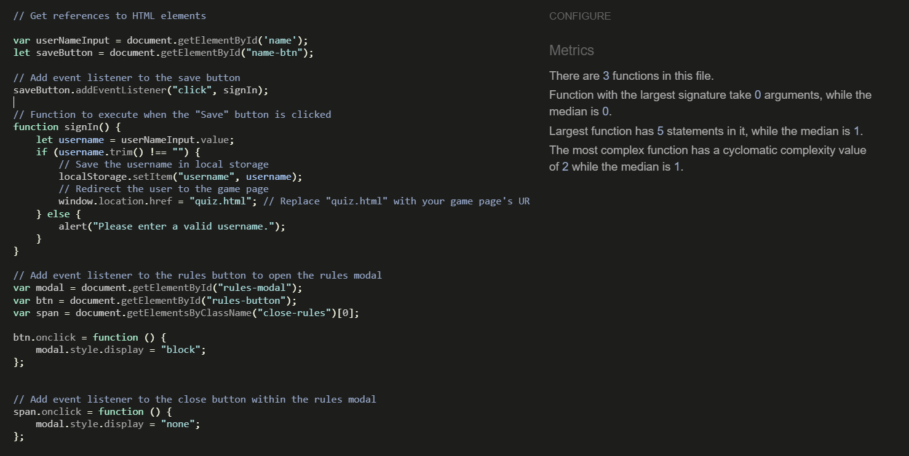

My custom index.html has passed through the official W3C validator with no issues.

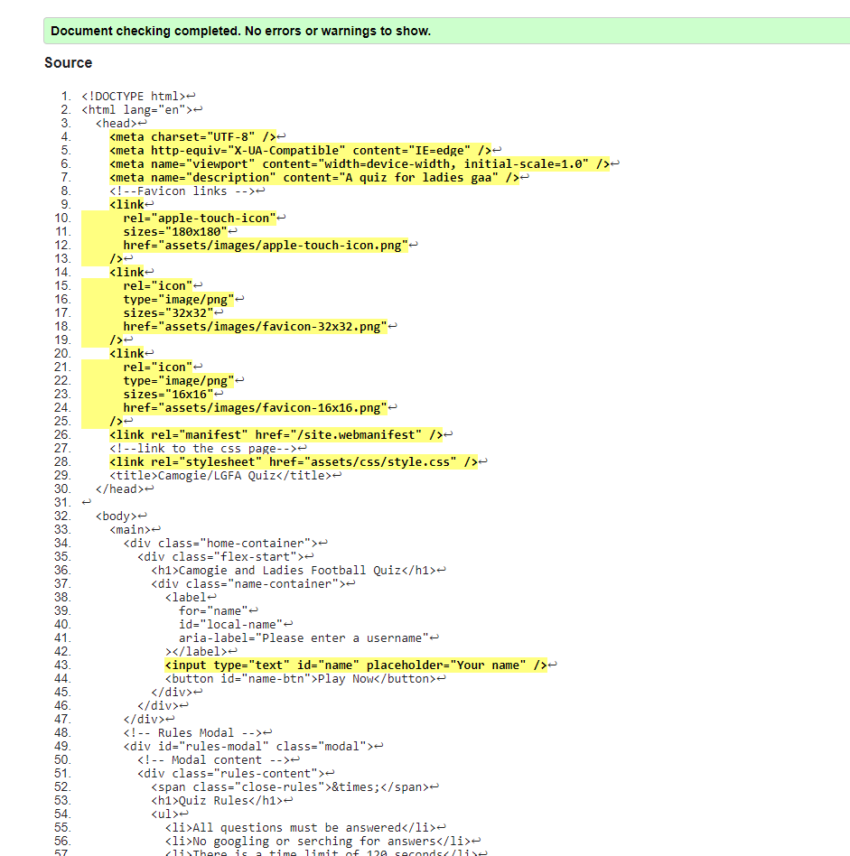

My custom quiz.html has passed through the official W3C validator with no issues.

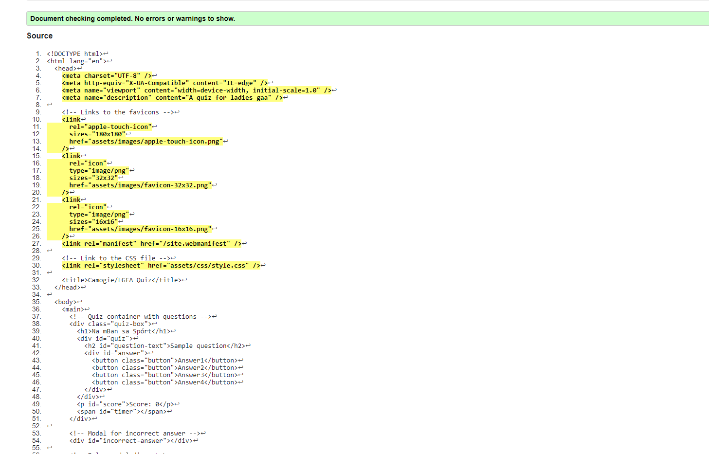

My custom 404.html has passed through the official W3C validator with no issues.

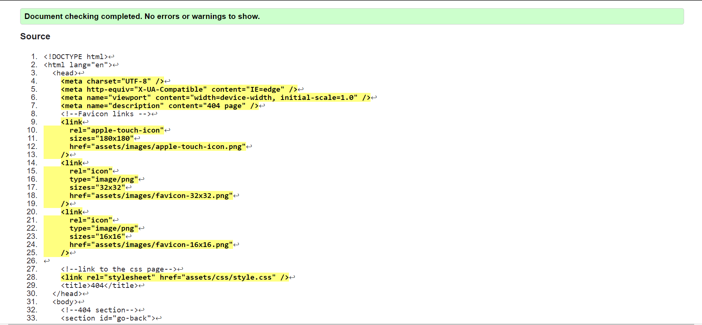

Custom CSS code that passes through the official (Jigsaw) validator with no issues

## Features

### Technologies Used

- **HTML:** The foundation of the website's structure and content. 
- **CSS:** Styling and layout to enhance the visual appeal and user experience.
- **JavaScript:** Interactive elements, dynamic content, and user engagement.
- **Codeanywhere:** Online development environment for coding and collaboration.
- **GitHub:** Version control and collaboration platform for hosting and managing the project.
- **Git:** Version control system to track changes and manage codebase.
- **Favicon:** Custom icons displayed in the browser's tab or bookmark bar.
- **Balsamiq:** Wireframing tool used for designing the initial website layout.
- **Unsplash:** Source of high-quality images to enhance visual aesthetics.

### Key Features

1. **Interactive Quiz:** Engaging quiz section featuring questions related to Camogie and LGFA.
2. **Score Tracking:** Real-time score tracking to keep users informed about their progress.
3. **Feedback Animation:** Visually appealing feedback animation for correct and incorrect answers.
4. **Modal Popups:** Informative modals for displaying final scores and quiz rules.
5. **Responsive Design:** Ensures a seamless experience across various screen sizes and devices.
6.  **Custom Styling:** Thoughtful styling using CSS to create an attractive and consistent design.
7.  **GitHub Hosting:** Hosted on GitHub Pages for easy access and sharing with others.

### Development Process

1. **Design Phase:** Wireframing with Balsamiq to plan the layout and visual elements. 
3. **Coding:** Implemented the design using HTML, CSS, and JavaScript for interactivity.
4. **Version Control:** Utilized Git for tracking changes and collaboration with GitHub.
5. **Testing:** Thoroughly tested the website's responsiveness and functionality.
6. **Deployment:** Hosted the website on GitHub Pages for public access.

## Deployment

### Version Control

The site was created using Codeanywhere code editor and pushed to github to the remote repository ‘LGFA-CamogieAssociation’.

The following git commands were used throughout development to push code to the remote repo:

```git add <file>``` - This command was used to add the file(s) to the staging area before they are committed.

```git commit -m “commit message”``` - This command was used to commit changes to the local repository queue ready for the final step.

```git push``` - This command was used to push all committed code to the remote repository on github.

### Deployment to Github Pages

- The site was deployed to GitHub pages. The steps to deploy are as follows:
  - In the GitHub repository, navigate to the Settings tab
  - From the menu on left select 'Pages'
  - From the source section drop-down menu, select the Branch: main
  - Click 'Save'
  - A live link will be displayed in a green banner when published successfully.

The live link can be found here - <https://danij1990.github.io/LGFA-CamogieAssociation/index.html>

### Clone the Repository Code Locally

Navigate to the GitHub Repository you want to clone to use locally:

- Click on the code drop down button
- Click on HTTPS
- Copy the repository link to the clipboard
- Open your IDE of choice (git must be installed for the next steps)
- Type git clone copied-git-url into the IDE terminal

The project will now of been cloned on your local machine for use.

## Future Development

In the future, there are several exciting enhancements planned for this project:

- **Database Integration**: Incorporating a database to store usernames and high scores will provide a more robust and structured way to manage user data. This will enable better tracking of user progress and facilitate features like leaderboards and personalized experiences.

- **API Integration**: Introducing an API layer will open up possibilities for seamless integration with external services or platforms. This could include allowing users to share their achievements on social media, interacting with other apps, or even enabling cross-device synchronization.

- **Expanded Question Sets**: Enriching the question pool with a broader range of questions will enhance user engagement and provide a more comprehensive learning experience. This could involve collaborating with subject matter experts to cover diverse topics and skill levels.

- **Enhanced User Experience**: Continuously improving the user interface and overall user experience will be pivotal. Implementing user feedback, optimizing performance, and ensuring accessibility across different devices and screen sizes will contribute to a polished and user-friendly application.

- **Gamification Elements**: Adding gamification elements like badges, achievements, or rewards for completing challenges or reaching milestones can make the learning process more enjoyable and motivating for users.

- **Localization and Internationalization**: Expanding language support and adapting content to cater to different regions and languages will make the application accessible to a broader global audience.

These planned developments will elevate the project by offering more features, engagement opportunities, and a more immersive learning environment for users.


## Credits and Thank You

I would like to extend my gratitude to the following individuals, websites, and resources that played a pivotal role in providing guidance and support throughout the creation of my JavaScript quiz:

- [Web Dev Simplified](https://www.youtube.com/watch?v=y17RuWkWdn8) - Your insightful tutorials helped me grasp complex concepts with ease. Thank you for simplifying the world of web development.

- [Web Dev Simplified](https://www.youtube.com/watch?v=FOD408a0EzU) - Your dedication to sharing knowledge is truly commendable. Your videos were instrumental in enhancing my understanding of JavaScript fundamentals.

- [Anna Kabow](https://www.youtube.com/watch?v=bOkuPo5VbTg&t=251s) - Anna, your tutorials are a beacon of clarity. Your explanations guided me through challenges, and I'm grateful for your detailed approach.

- [Zenva](https://www.youtube.com/watch?v=RswgVWKJRLM&t=374s) - Zenva, your comprehensive tutorials opened up new possibilities for my quiz project.

- Upsplash - [Adrian Payne](https://unsplash.com/photos/Mf_nmDrHbFE) - Adrian, thank you for sharing your photograph on Upsplash. It added a touch of visual appeal to my project.

- [W3Schools](https://www.w3schools.com/jsref/met_win_setinterval.asp), [W3Schools](https://www.w3schools.com/jsref/met_win_settimeout.asp), [W3Schools](https://www.w3schools.com/howto/howto_css_modals.asp) - The resources from W3Schools were invaluable references that I frequently turned to during development. Thank you for compiling a rich repository of web knowledge.

- [Stack Overflow](https://stackoverflow.com/search?q=javascript+quiz+app&s=ef72ab1a-bdbf-4dbe-bf11-fed4daac78e8) - To the Stack Overflow community, your discussions and solutions were lifesavers whenever I encountered roadblocks. Thank you for being an endless source of solutions.

- Jamie Oneill - [LinkedIn](https://www.linkedin.com/in/jamie2023/) - Jamie, your professional insights and advice were incredibly helpful in refining my project. 

- Discord - The Coding Den - The members of The Coding Den Discord community, thank you for being a place where I could exchange ideas, seek assistance, and grow as a developer.

To everyone mentioned above, your contributions made a significant difference in my journey to create this JavaScript quiz. Thank You.

## Bugs

**Bug Description**

An issue arose when attempting to use username local storage on the home page, I added the below syntax to the script.js page and it was linked to my index.html file. When I entered a username, and hit the paly button my questions stored in my array would not load.

Commit message - try to fix bug error


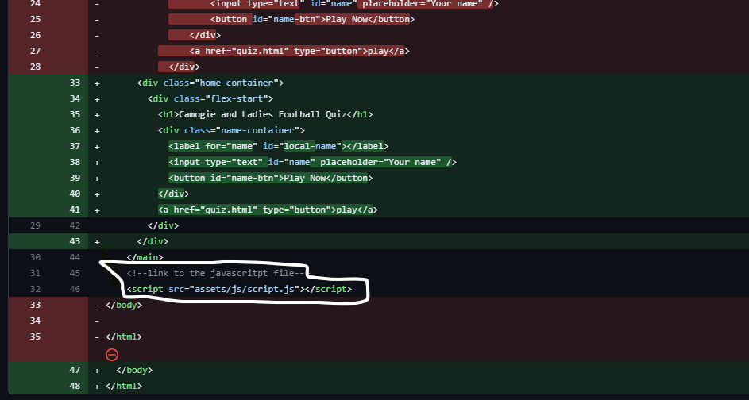

**Bug Resolution**

After extensive troubleshooting, utilizing insights and approaches detailed in the "Credits" section of this readme, I successfully resolved the bug. The issue, which resulted in the questions not loading correctly on the quiz page despite several attempts, required an innovative solution. By creating a separate file named Home.js and establishing a link between this file and the index.html, I was able to rectify the problem and ensure the questions loaded as expected. This solution not only eliminated the bug but also enhanced the overall performance of the quiz application. The experience underscores the value of collaboration and persistent problem-solving in software development.


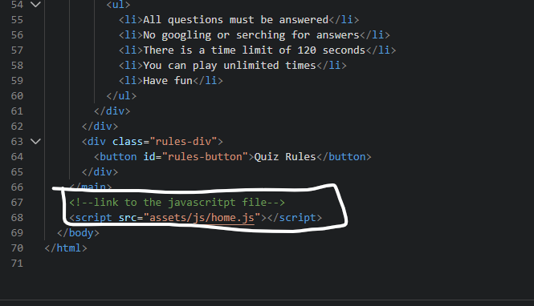


## Contact

Daniel Hughes, Mullingar Co Westmeath, Ireland.

Phone : +353 852570069

Email : danijhughes@gmail.com

Git Hub : danij1990

Linkedin: <https://www.linkedin.com/in/daniel-hughes-36a948258/>

Facebook: <https://www.facebook.com/danny.hughes.96558>

